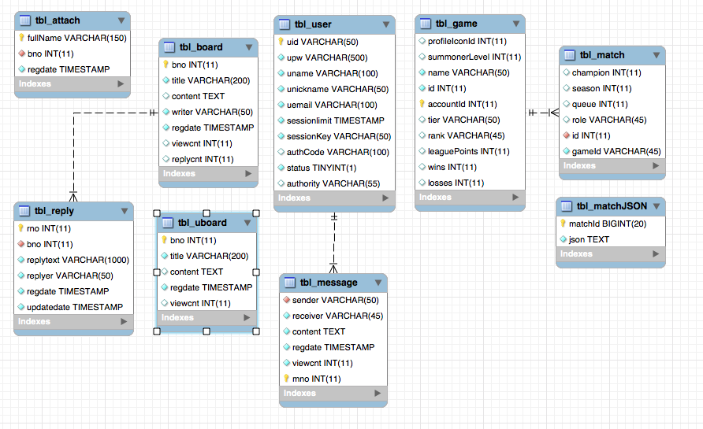

# SpringMVC 웹 서비스

## 개발 기간
* 2018.01 ~ 2018.03

## 개발 목적
* 가장 친숙한 서비스를 직접 구현.
* 게임 업데이트 정보를 편하게 봄. 
* 분리되어 있는 커뮤니티와 검색 서비스를 통합.

## 개발 환경
* 언어 : Java
* Front : HTML, CSS, Bootstrap, JSP, JQuery
* Back : Spring MVC, mybatis
* DB : MySQL
* Server : Tomcat
* Build : Maven
* IDE : STS
* OS : Mac OS 

## 기능
* lol 업데이트 게시판 크롤링
* 자유게시판
* 네이버 아이디로 회원가입
* 회원간 채팅 및 메시지
* lol 전적검색 (riot games api)

## ERD
</img>

## 스크린샷
# 메인
</img>
# 자유게시판
</img>
# 크롤링 게시판
</img>
# 전적검색 메인
</img>
# 전적검색 상세보기
</img>
