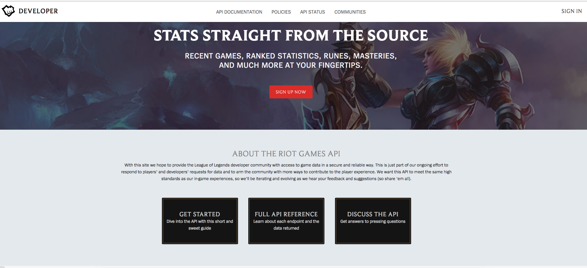
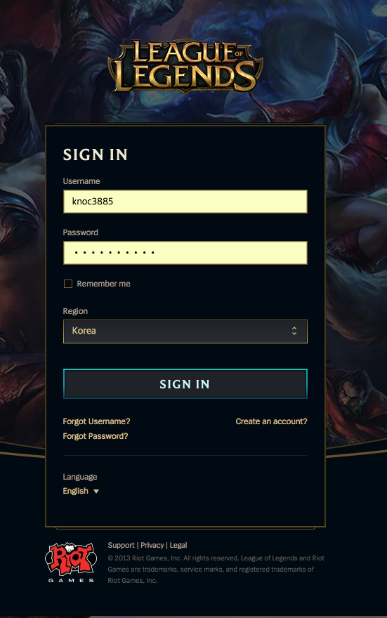
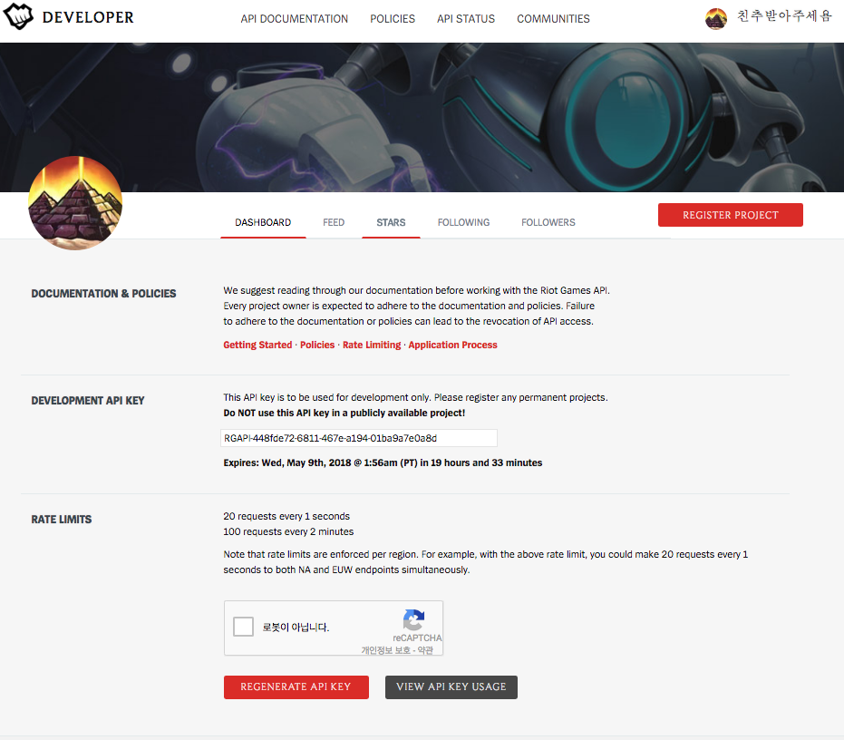
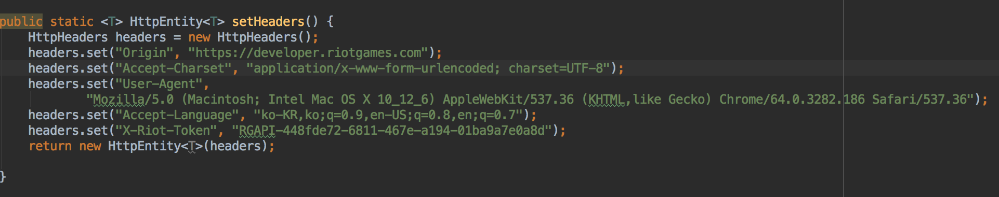

# lol-cummunity-springMVC
## 개발 기간
* 2018.01 ~ 2018.04

## 개발 동기
* 자주 사용하는 서비스를 직접 구현하고 싶었음.

## 개발 목적
* 가장 친숙한 서비스를 직접 구현.
* 게임 업데이트 정보를 편하게 봄. 
* 분리되어 있는 커뮤니티와 검색 서비스를 통합.

## 개발 환경
* 언어 : Java
* Front : HTML, CSS, Bootstrap
* Back : Spring MVC, JavaScript & JQuery, myBatis
* DB : MySQL
* Server : Tomcat
* Build : Maven
## 기능
* CRUD 자유게시판
* 공지사항 (LOL 업데이트 게시판을 자동으로 크롤링)
* 회원 기능 ( 가입, 정보 수정 ), 네이버 계정으로 회원가입
* 회원 간 메세지, 채팅 기능
* 이메일 인증 기능
* 소환사 검색 ( 기본적인 소환사 정보 표기, 참여한 게임 정보, 많이 선택한 챔피언 별 피해량 표, 게임 당 상세 분석 기능 )
* 전체 챔피언 별 통계 ( 승률 ) 
## DB 설계
</img>

## 전적 검색 기능 사용 방법
* REST API를 사용하기 위해 Riot 계정으로 Token을 발급받아야 함. (Expire될 경우 갱신)
* 제 계정을 사용하세요 ( ID : knoc3885 / PW : vlckd123!@ )

1. https://developer.riotgames.com/ 접속 (Riot-developer 지원 페이지 - REST API 제공)
</img>

2. 로그인 ( korea 서버 선택 필수 )
</img>

3. 하단에 Captcha 인증 후 regenerate key 눌러서 갱신한 후 복사.
</img>

4. src/main/java/org/knoc/service/LOLServiceImpl.java 파일의 상단 setHeaders 메소드의 
    "X-Riot-Token" 부분의 2번째 param에 복사한 키를 붙여넣기
</img>

5. 실행 후 main 확인
</img>

